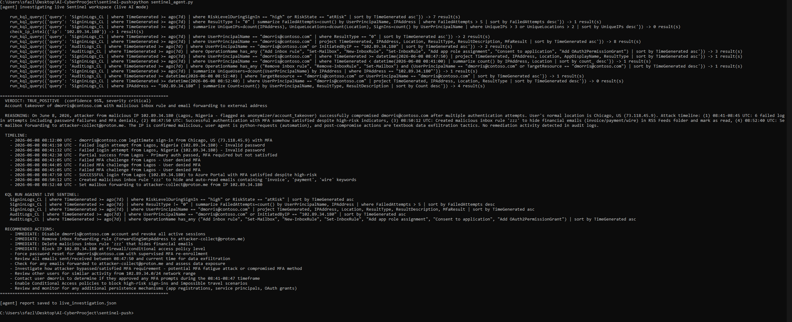
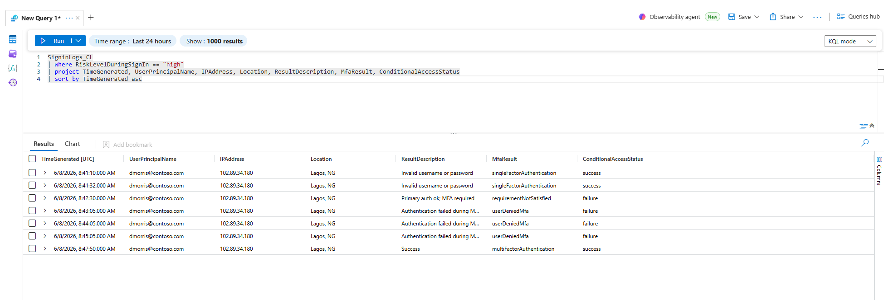
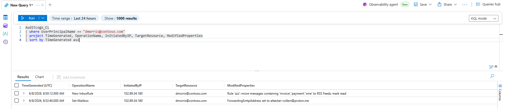
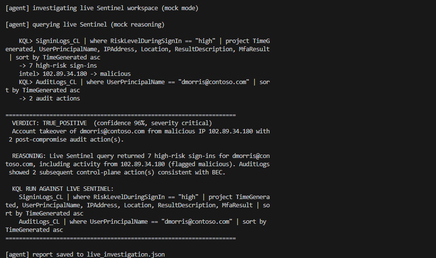

# AI-Powered Microsoft Sentinel Alert Triage Agent

An AI agent that investigates security alerts in Microsoft Sentinel. It writes KQL queries, pulls logs from a live Sentinel workspace, connects the events, and gives a first-pass verdict on whether an alert looks like a real compromise or a false alarm.

I built this because alert triage takes a lot of time. Many alerts end up being harmless, but an analyst still has to check the sign-ins, audit logs, IPs, and timeline. I wanted to see how far an AI agent could get on that first pass when it had access to a real SIEM instead of a toy dataset.

## What it is

- Microsoft Sentinel running in Azure, with a custom data pipeline I built to send logs into the workspace.
- Two KQL detections that identify an email account takeover and map the activity to MITRE ATT&CK.
- An agent built with the Claude API that connects to Sentinel, writes its own KQL queries, and reports what it finds.

## How it works

The logs are pushed into Sentinel through the Azure Monitor Logs Ingestion API. They land in two custom tables:

- `SigninLogs_CL`
- `AuditLogs_CL`

Both the KQL detections and the agent read from these tables.

When I first started building the pipeline, I tried using the built-in data connectors. The problem was that the connectors I needed were built for agent-based collection, which did not fit the custom log data I was using. I ended up switching to a custom Data Collection Rule and Data Collection Endpoint with the Logs Ingestion API.

One thing that confused me at first was the delay after the first data push. The first ingest into a brand-new custom table took about 20 minutes to show up in Sentinel. The push had succeeded, but the table was not visible right away.

The agent reads from Sentinel using the Logs Query API. The Claude API handles the reasoning. I give the agent a goal and a small set of tools, then it chooses which KQL queries to run based on the results it gets back.

## The attack scenario

The dataset is synthetic, but it is mixed with normal user activity so the detections have to find the actual attack instead of just confirming the only suspicious activity in the logs.

The attack flow:

1. An attacker guesses a user's password from an overseas IP address.
2. The attacker sends repeated MFA prompts until the user approves one.
3. After getting access, the attacker creates a hidden inbox rule to hide emails about invoices, payments, and wire transfers.
4. The attacker sets up forwarding to send copies of emails to an external address.

I also added two false alarms on purpose:

- A user who really did travel.
- A user who approved a legitimate application.

A useful investigation should clear those cases instead of flagging everything as malicious.

The logs follow the real Microsoft Entra sign-in format, including result codes such as:

- `50126` for an invalid password.
- `500121` for a denied MFA prompt.

The data is synthetic and does not come from a real environment.

## KQL detections

### Account takeover

This detection filters sign-ins to high-risk events. It shows the attack in order: password guessing, denied MFA prompts, and the successful login from the same suspicious IP address.

MITRE ATT&CK mapping:

- T1110: Brute Force
- T1621: Multi-Factor Authentication Request Generation
- T1078: Valid Accounts

```kql
SigninLogs_CL
| where RiskLevelDuringSignIn == "high"
| project TimeGenerated, UserPrincipalName, IPAddress, Location, ResultDescription, MfaResult, ConditionalAccessStatus
| sort by TimeGenerated asc
```

### Post-compromise actions

This detection checks the audit logs for actions taken after the account was accessed. In this scenario, the attacker creates a hidden inbox rule and sets up external forwarding.

MITRE ATT&CK mapping:

- T1564.008: Hide Artifacts: Email Hiding Rules
- T1114.003: Email Collection: Email Forwarding Rule

```kql
AuditLogs_CL
| where UserPrincipalName == "dmorris@contoso.com"
| project TimeGenerated, OperationName, InitiatedByIP, TargetResource, ModifiedProperties
| sort by TimeGenerated asc
```

## The agent

The agent has two tools:

- Run a KQL query against the Sentinel workspace.
- Check whether an IP address is known bad.

Its goal is to decide whether an account was compromised. It does this by choosing each query based on what it found in the previous step.

In one test run, the agent wrote 15 KQL queries without me pre-writing the investigation steps. It found the high-risk sign-ins, checked for password guessing, compared the user's normal login locations, checked the suspicious IP, traced the timeline across both tables, and looked for other accounts targeted from the same IP address.

At the end, it returned a true-positive verdict with a timeline and recommended response steps.

## Modes

The project has two modes:

- **Live mode**: The Claude API chooses every query and investigation step.
- **Mock mode**: The script still queries the real Sentinel workspace, but it uses scripted steps so it can run without a Claude API key.

## Screenshots

The agent running a full investigation against live Sentinel. It was only told to look for possible compromise. It ran 15 queries on its own and wrote the verdict, timeline, and next steps.



The account takeover in the sign-in logs. The logs show failed password attempts from overseas, denied MFA prompts, and the successful login after the user approved MFA.



The post-compromise activity in the audit logs. The attacker created an inbox rule to hide financial emails and set up forwarding to an external address.



The agent running in mock mode. This version works without a Claude API key.



## Repository layout

| Path | What it does |
|------|--------------|
| `data/generate_logs.py` | Generates the synthetic logs |
| `data/*.json` | Stores the generated sign-in and audit logs |
| `push_to_sentinel.py` | Pushes the logs into Microsoft Sentinel |
| `detection/*.kql` | Stores the KQL detections |
| `sentinel_agent.py` | Runs the alert triage agent |

## Running it

```bash
pip install azure-monitor-query azure-identity anthropic

# Put credentials in a .env file.
# See .env.example for the required values.
# Do not commit your .env file.

python sentinel_agent.py --mock     # Scripted investigation, no Claude API key required
python sentinel_agent.py            # Full agent mode
```

The app used for queries needs the **Log Analytics Reader** role on the workspace.

## Limitations

- The dataset is synthetic and small. It has one tenant, one attack scenario, and about 60 records.
- Real environments are much larger and noisier.
- The detections cover known attack patterns. They are useful for this project, but they are not new detection research.
- The agent is a helper, not a replacement for an analyst. A person should still make the final decision.
- A production version would need query limits, better error handling, protection against bad or misleading log data, and more log sources.
- The threat intelligence check uses a small local list instead of a live threat feed.

## What I worked with

- Microsoft Sentinel
- Azure Log Analytics
- Azure Monitor Logs Ingestion API
- Azure Monitor Logs Query API
- Data Collection Rules
- Data Collection Endpoints
- Microsoft Entra app registrations
- Role-based access control
- KQL detections
- MITRE ATT&CK mapping
- Claude API tool use